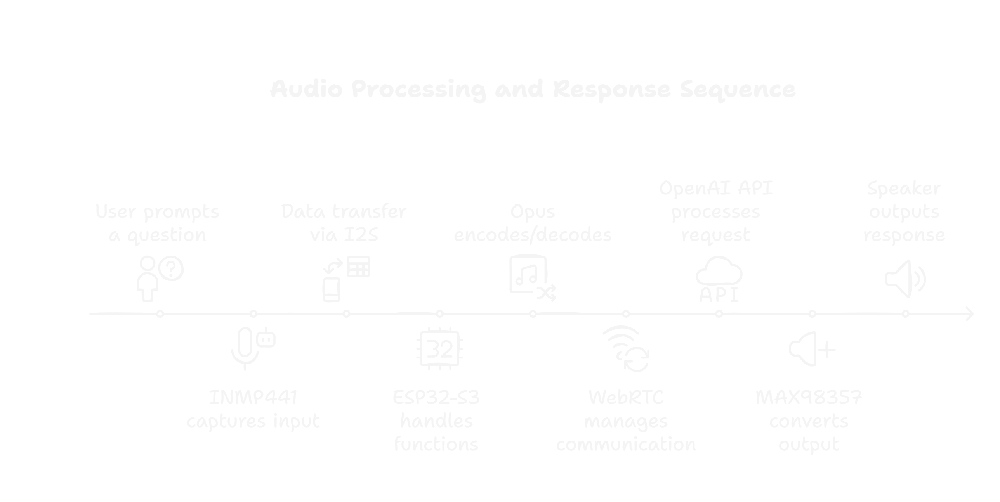

# ESP32-S3 Embedded w/ OpenAI-Realtime-API

<div align="center">



[](https://docs.espressif.com/projects/esp-idf/en/latest/esp32s3/index.html)
[](LICENSE)
[](src/)


</div>

## Project

This project integrates OpenAI GPT-4o-Mini-Realtime model with the ESP32-S3 microcontroller, creating a powerful embedded voice assistant. Using WebRTC for peer-to-peer communication, it delivers:

- **Real-time Voice Processing**: Direct integration with OpenAI API
- **Embedded System Design**: Complete hardware-software integration
- **Low Latency**: Eliminates traditional speech-to-text and text-to-speech delays
- **Portable Solution**: Standalone operation with WiFi connectivity

## Hardware Stack

### Core Components
- **ESP32-S3 Freeonove Wroom**  
  - 8MB PSRAM
  - 16MB Flash
- **INMP441** MEMS Microphone
- **MAX98357A** I2S Amplifier
- **4Ω 3W** Speaker

### Pin Configuration

<details>
<summary> INMP441 Microphone Connections</summary>

```
BCLK  → GPIO 47
LRCLK → GPIO 41
DATA  → GPIO 45
GND   → GND
VDD   → 3.3V
L/R   → GND
```
</details>

<details>
<summary> MAX98357A Amplifier Connections</summary>

```
BCLK  → GPIO 20
LRCLK → GPIO 21
DIN   → GPIO 19
GND   → GND
VIN   → 3.3V
```
</details>

## Software Requirements

- **ESP-IDF** v5.0.2 or higher
- **CMake** 3.16 or higher

## Getting Started

### 1. Install ESP-IDF

<details>
<summary>Linux/macOS Installation</summary>

```bash
git clone --recursive https://github.com/espressif/esp-idf.git
cd esp-idf
./install.sh
. ./export.sh
```
</details>

<details>
<summary>Windows Installation</summary>

```powershell
git clone --recursive https://github.com/espressif/esp-idf.git
cd esp-idf
./install.ps1
./export.ps1
```
</details>

### 2. Clone Repo

```bash
# Clone with submodules
git clone --recursive https://github.com/0xzhng/ESP32-S3
cd ESP32-S3
```

### 3. Configure Project

```bash
# Set target to ESP32-S3
idf.py set-target esp32s3

# Optional configuration
idf.py menuconfig
```

### 4. Set Environment Variables

<details>
<summary>Linux/macOS Environment Setup</summary>

```bash
export WIFI_SSID="your_wifi_name"
export WIFI_PASSWORD="your_wifi_password"
export OPENAI_API_KEY="your_api_key"
```
Add to `~/.bashrc` or `~/.bash_profile` for persistence
</details>

<details>
<summary>Windows Environment Setup</summary>

```powershell
$env:WIFI_SSID="your_wifi_name"
$env:WIFI_PASSWORD="your_wifi_password"
$env:OPENAI_API_KEY="your_api_key"

# For permanent storage (Recommended for security reasons):
[System.Environment]::SetEnvironmentVariable("WIFI_SSID", "your_wifi_name", "User")
[System.Environment]::SetEnvironmentVariable("WIFI_PASSWORD", "your_wifi_password", "User")
[System.Environment]::SetEnvironmentVariable("OPENAI_API_KEY", "your_api_key", "User")
```
</details>

### 5. Build and Flash

```bash
# Build project
idf.py build

# Flash and monitor (replace [PORT] with your device port)
idf.py -p [PORT] flash monitor
```

## Monitoring and Debugging

```bash
# Monitor serial output
idf.py monitor
```

## Architecture

### WiFi Module (`wifi.cpp`)
- Station (STA) mode connectivity
- Automatic reconnection (5 retries)
- Event-driven connection management
- IP acquisition handling

### WebRTC Module (`webrtc.cpp`)
- Peer connection management
- Audio streaming with OPUS codec
- Data channel communication
- ICE candidate handling
- 15ms tick interval operation

### Media Handler (`media.cpp`)
- **I2S Interfaces**:
  - `I2S_NUM_0`: Audio Output (MAX98357A) (DAC)
  - `I2S_NUM_1`: Audio Input (INMP441) (MIC)
- **Audio Configuration**:
  - Sample Rate: 8kHz
  - Buffer Size: 320 samples
  - Format: 16-bit
- **OPUS Settings**:
  - Bitrate: 30kbps
  - Complexity: 0 (embedded-optimized)

## Protocol

- WebRTC peer-to-peer communication
- Reliable data channels
- ICE protocol for NAT traversal
- OPUS audio compression


